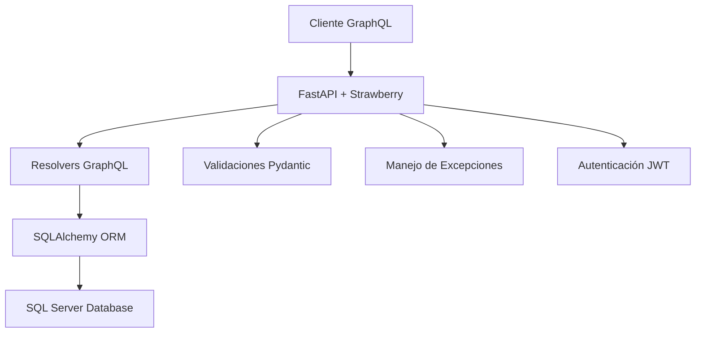

# 🚀 FastAPI GraphQL + SQL Server


> Una API GraphQL moderna y eficiente construida con FastAPI, Strawberry GraphQL y SQL Server para gestión de registros con arquitectura robusta y escalable.

## 📑 Tabla de Contenidos

- [🌟 Características](#-características)
- [🏗️ Arquitectura](#️-arquitectura)
- [⚡ Instalación Rápida](#-instalación-rápida)
- [🔧 Configuración](#-configuración)
- [🚀 Uso](#-uso)
- [📖 Ejemplos de GraphQL](#-ejemplos-de-graphql)
- [🏛️ Estructura del Proyecto](#️-estructura-del-proyecto)
- [🔒 Seguridad](#-seguridad)
- [📊 Base de Datos](#-base-de-datos)
- [🤝 Contribuir](#-contribuir)
- [📄 Licencia](#-licencia)
- [👨‍💻 Autor](#-autor)

## 🌟 Características

✨ **API GraphQL Completa** - CRUD completo con Queries y Mutations  
🔐 **Autenticación JWT** - Sistema de autenticación seguro opcional  
🛡️ **Validaciones Robustas** - Validación de datos integrada  
📊 **SQL Server** - Integración optimizada con Microsoft SQL Server  
🎯 **Tipado Fuerte** - Esquemas GraphQL fuertemente tipados  
🚄 **Alto Rendimiento** - Construido sobre FastAPI y SQLAlchemy  
📝 **Documentación Interactiva** - GraphiQL integrado para pruebas  
🔧 **Configuración Flexible** - Configuración por variables de entorno  

## 🏗️ Arquitectura



## ⚡ Instalación Rápida

### Prerequisitos

- Python 3.8+
- SQL Server (LocalDB, Express, o Full)
- ODBC Driver para SQL Server

### 1. Clonar el repositorio

```bash
git clone https://github.com/piodois/graphql.git
cd graphql
```

### 2. Crear entorno virtual

```bash
python -m venv venv
source venv/bin/activate  # En Windows: venv\Scripts\activate
```

### 3. Instalar dependencias

```bash
pip install -r requirements.txt
```

### 4. Configurar variables de entorno

```bash
cp .env.example .env
# Editar .env con tus configuraciones
```

### 5. Ejecutar la aplicación

```bash
uvicorn app.main:app --reload
```

🎉 **¡Listo!** Visita http://localhost:8000/graphql para usar GraphiQL

## 🔧 Configuración

### Variables de Entorno (.env)

```env
# 🗄️ Configuración de Base de Datos
DB_HOST=localhost
DB_PORT=1433
DB_NAME=master
DB_USER=tu_usuario
DB_PASSWORD=tu_contraseña
DB_TRUSTED_CONNECTION=True

# 🔐 Configuración de Seguridad
SECRET_KEY=tu_clave_secreta_super_segura_de_32_caracteres
ALGORITHM=HS256
ACCESS_TOKEN_EXPIRE_MINUTES=30

# ⚙️ Configuración de la Aplicación
DEBUG=True
BACKEND_CORS_ORIGINS=["http://localhost:3000", "http://localhost:8080"]

# 📊 Límites y Paginación
DEFAULT_LIMIT=100
MAX_LIMIT=1000
```

## 🚀 Uso

### Acceder a GraphiQL

Navega a **http://localhost:8000/graphql** para usar la interfaz interactiva de GraphQL.


### Endpoints Disponibles

| Endpoint | Descripción |
|----------|-------------|
| `/graphql` | Endpoint principal de GraphQL |
| `/` | Página de bienvenida |
| `/health` | Estado del sistema |
| `/docs` | Documentación Swagger (FastAPI) |

## 📖 Ejemplos de GraphQL

### 🔍 **Query: Obtener todos los registros**

```graphql
query ObtenerRegistros {
  registros(skip: 0, limit: 10) {
    success
    message
    total
    registros {
      id
      documento
      nombre
      fechaCreacion
    }
  }
}
```

### 🔍 **Query: Buscar registro por ID**

```graphql
query BuscarRegistro($id: Int!) {
  registro(id: $id) {
    success
    message
    registro {
      id
      documento
      nombre
      fechaCreacion
    }
  }
}
```

**Variables:**
```json
{
  "id": 1
}
```

### ➕ **Mutation: Crear nuevo registro**

```graphql
mutation CrearRegistro($input: RegistroInput!) {
  crearRegistro(registroInput: $input) {
    success
    message
    registro {
      id
      documento
      nombre
      fechaCreacion
    }
  }
}
```

**Variables:**
```json
{
  "input": {
    "documento": 12345678,
    "nombre": "Juan Pérez"
  }
}
```

### ✏️ **Mutation: Actualizar registro**

```graphql
mutation ActualizarRegistro($id: Int!, $input: RegistroUpdateInput!) {
  actualizarRegistro(id: $id, registroInput: $input) {
    success
    message
    registro {
      id
      documento
      nombre
      fechaCreacion
    }
  }
}
```

**Variables:**
```json
{
  "id": 1,
  "input": {
    "nombre": "Juan Carlos Pérez"
  }
}
```

### 🗑️ **Mutation: Eliminar registro**

```graphql
mutation EliminarRegistro($id: Int!) {
  eliminarRegistro(id: $id) {
    success
    message
    registro {
      id
      documento
      nombre
      fechaCreacion
    }
  }
}
```

**Variables:**
```json
{
  "id": 1
}
```

## 🏛️ Estructura del Proyecto

```
graphql/
│
├── 📁 app/
│   ├── 📁 core/                    # ⚙️ Configuración central
│   │   ├── config.py               # 🔧 Variables de configuración
│   │   ├── database.py             # 🗄️ Configuración de BD
│   │   └── security.py             # 🔐 Funciones de seguridad
│   │
│   ├── 📁 exceptions/              # ⚠️ Manejo de excepciones
│   │   ├── handlers.py             # 🛠️ Manejadores de errores
│   │   └── http_exceptions.py      # 🚨 Excepciones HTTP
│   │
│   ├── 📁 graphql/                 # 🍓 Configuración GraphQL
│   │   ├── __init__.py
│   │   ├── resolvers.py            # 🔧 Resolvers GraphQL
│   │   └── schemas.py              # 📋 Esquemas GraphQL
│   │
│   ├── 📁 models/                  # 🏗️ Modelos SQLAlchemy
│   │   ├── base.py                 # 📏 Modelo base
│   │   ├── registro.py             # 📝 Modelo de registro
│   │   └── usuario.py              # 👤 Modelo de usuario
│   │
│   ├── 📁 routers/                 # 🛣️ Rutas REST (opcional)
│   │   └── auth.py                 # 🔑 Autenticación
│   │
│   ├── 📁 schemas/                 # 📊 Esquemas Pydantic
│   │   ├── registro.py             # 📝 Esquemas de registro
│   │   ├── token.py                # 🎫 Esquemas de token
│   │   └── usuario.py              # 👤 Esquemas de usuario
│   │
│   ├── 📁 utils/                   # 🛠️ Utilidades
│   │   └── validators.py           # ✅ Validadores
│   │
│   └── main.py                     # 🚀 Punto de entrada
│
├── 📄 requirements.txt             # 📦 Dependencias
├── 📄 .env.example                 # 🔧 Ejemplo de configuración
└── 📄 README.md                    # 📖 Este archivo
```

## 🔒 Seguridad

- 🛡️ **Autenticación JWT** - Tokens seguros con expiración
- 🔐 **Contraseñas hasheadas** - bcrypt para hash de contraseñas
- ✅ **Validación de datos** - Validación robusta con Pydantic
- 🚫 **Rate limiting** - Protección contra ataques de fuerza bruta
- 🛡️ **CORS configurado** - Control de origen de peticiones
- 🔍 **Manejo de errores seguro** - Sin exposición de datos sensibles

## 📊 Base de Datos

### Esquema de la tabla `registros`

| Campo | Tipo | Descripción |
|-------|------|-------------|
| `id` | INT (PK) | Identificador único |
| `documento` | INT | Número de documento |
| `nombre` | VARCHAR(100) | Nombre del registro |
| `fecha_creacion` | DATETIME | Fecha de creación |

### Comandos SQL útiles

```sql
-- Crear tabla de registros
CREATE TABLE registros (
    id INT IDENTITY(1,1) PRIMARY KEY,
    documento INT NOT NULL,
    nombre VARCHAR(100) NOT NULL,
    fecha_creacion DATETIME DEFAULT GETDATE()
);

-- Insertar datos de prueba
INSERT INTO registros (documento, nombre) VALUES 
(12345678, 'Juan Pérez'),
(87654321, 'María González');
```

## 🧪 Testing

### Ejecutar con curl

```bash
# Query GraphQL
curl -X POST http://localhost:8000/graphql \
  -H "Content-Type: application/json" \
  -d '{"query": "{ registros { success message total } }"}'
```

### Ejemplos de respuestas

**✅ Respuesta exitosa:**
```json
{
  "data": {
    "registros": {
      "success": true,
      "message": "Registros obtenidos exitosamente",
      "total": 2
    }
  }
}
```

**❌ Respuesta con error:**
```json
{
  "data": {
    "crearRegistro": {
      "success": false,
      "message": "El documento debe ser un número positivo",
      "registro": null
    }
  }
}
```

## 🤝 Contribuir

¡Las contribuciones son bienvenidas! Por favor:

1. 🍴 Fork el proyecto
2. 🌿 Crea una rama para tu feature (`git checkout -b feature/AmazingFeature`)
3. 💾 Commit tus cambios (`git commit -m 'Add some AmazingFeature'`)
4. 📤 Push a la rama (`git push origin feature/AmazingFeature`)
5. 🔄 Abre un Pull Request

### 💡 Ideas para contribuir

- 📊 Agregar más tipos de consultas GraphQL
- 🔐 Implementar autenticación con GraphQL
- 📝 Mejorar la documentación
- 🧪 Agregar tests unitarios
- 🐳 Dockerizar la aplicación
- 📊 Agregar métricas y monitoring

## 📄 Licencia

Este proyecto está bajo la Licencia MIT. Ver el archivo [LICENSE](LICENSE) para más detalles.

## 👨‍💻 Autor

**Pio Cerda**

- 🐙 GitHub: [@piodois](https://github.com/piodois)
- 💼 LinkedIn: [Pio Cerda](https://www.linkedin.com/in/piocerda/)
- 📧 Email: piodois1@gmail.com

---

<div align="center">

### ⭐ ¡Si te gusta este proyecto, dale una estrella! ⭐

**Construido con ❤️ usando FastAPI, GraphQL y SQL Server**


</div>
```

## Adicional: Archivo .env.example

También crea un archivo `.env.example`:

```env
# 🗄️ Configuración de Base de Datos
DB_HOST=localhost
DB_PORT=1433
DB_NAME=master
DB_USER=tu_usuario
DB_PASSWORD=tu_contraseña
DB_TRUSTED_CONNECTION=True

# 🔐 Configuración de Seguridad
SECRET_KEY=clave_secreta_para_jwt_de_32_caracteres_minimo
ALGORITHM=HS256
ACCESS_TOKEN_EXPIRE_MINUTES=30

# ⚙️ Configuración de la Aplicación
DEBUG=True
BACKEND_CORS_ORIGINS=["http://localhost:3000", "http://localhost:8080"]

# 📊 Límites y Paginación
DEFAULT_LIMIT=100
MAX_LIMIT=1000
```